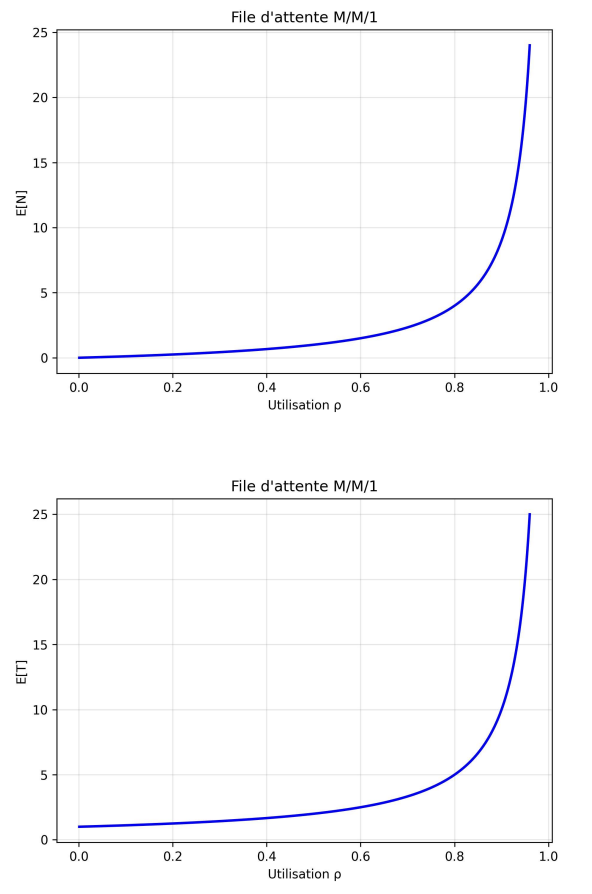

Questions to answer
==================================

These are the questions related to the M/M/1 queueing model using SimPy.

You will need to answer the questions in this file. Your answers will be graded. 

You can answer in English or French.


1-Implement the M/M/1 queueing model in SimPy
---------------------------------------------

### The implementation in the file `models/simpy_m_m_1.py` counts for 4 points maximum. (4p)

Below, you can find the implementation of the two functions `generate_requests` and `process_request`.

```py
def generate_requests(self):
    """Generate requests following a Poisson process."""
    while True:
        # ******** Add your code here ********
        # Generates the waiting time until the next client.
        interarrival_time = np.random.exponential(self.interarrival_time)
        # Waits this time.
        yield self.env.timeout(interarrival_time)
        # Process the request.
        yield self.env.process(self.process_request())


def process_request(self):
    """Place a request in the queue and process it when the server is available.
    
    The method also records statistics about the response time.
    """
    arrival_time = self.env.now

    # ******** Add your code here ********
    # Waits until the server is ready.
    with self.server.request() as req:
        yield req
        # Serves the client.
        service_duration = np.random.exponential(self.service_time)
        yield self.env.timeout(service_duration)

    departure_time = self.env.now
    self.response_times.append(departure_time - arrival_time)
```

2-Validate the simulation model
-------------------------------

#### Show at least 3 different simulation results with different parameters and compare them with the analytical model. (6p)

*The parameter `p` is defined as the ratio of the arrival rate to the service rate.*

*To simulate the M/M/1 queue, we consider three values of p : `0.2`, `0.6` and `0.8`. These values are chosen to show the impact on the expected response time E[T] and the expected number of clients in the system E[N]. As p increases, the system becomes more heavily loaded, so both the response time and the queue length grow. Specially with high values of p, that lead to longer delays and larger queues.*



Below, you can find the differents results.

```bash
With p = 0.2

Mean response time: 0.0201 seconds
Mean number of clients in the system: 0.1672

With p = 0.6

With p = 0.8

```


3-Evaluate the impact of an load increase
-----------------------------------------

#### What are the simulation results when running with `ARRIVAL_RATE = 30/s` and `SERVICE_RATE = 50/s`? (2p)

*Your answer here*

#### What are the simulation results when running with a 40% increased `ARRIVAL_RATE`? (2p)

*Your answer here*

#### Interpret and explain the results. (3p)

*Your answer here*


4-Doubling the arrival rate
---------------------------

#### What are the simulation results when running with `ARRIVAL_RATE = 40/s` and `SERVICE_RATE = 50/s`? What is the utilization of the server? (2p)

*Your answer here*

#### What is the value of `SERVICE_RATE` that achieves the same mean response time when doubling the `ARRIVAL_RATE` to `80/s`? What is the server utilization in that case? (2p)

*Your answer here*

#### Use the analytical M/M/1 model to confirm your findings. (3p)

*Your answer here*

#### Describe and interpret the results. (3p)

*Your answer here*


5-Rule of Bertsekas and Gallager
--------------------------------

#### Describe your experiments and results. (2p)

*Your answer here*

#### Provide an analytical explanation of your findings. (2p)

*Your answer here*


Conclusion
----------

#### Document your conclusions here. What did you learn in this lab? (2p)

*Your answer here*
